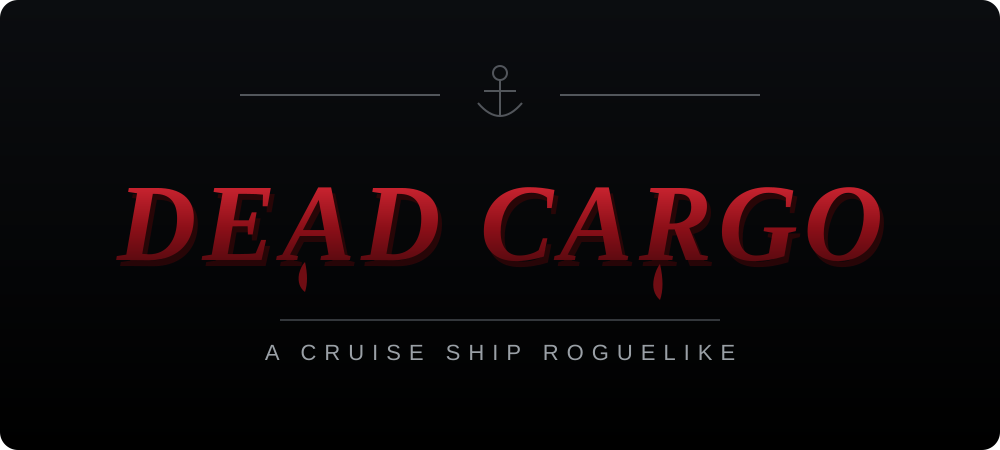

# Dead Cargo
## A Roguelike Horror Inventory Management Adventure



## Core Concept
"Dead Cargo" is a top-down survival horror game where players control a courier trapped in a cursed cargo ship overrun by zombies. Inspired by Resident Evil's inventory system and Escape from Tarkov's loot containers, players must carefully manage limited, irregularly-shaped inventory space while scavenging supplies, fighting or fleeing the undead, and finding a way off the ship.

## Current Gameplay

### Resident Evil / Tarkov-Style Inventory
- A grid inventory where every item occupies its own irregular shape (a Tetris-style cell mask), not just a rectangle — a pistol is a small L, a shotgun a large L, first aid is 2x1, ammo and herbs are 1x1.
- Items can be dragged to any free spot in the grid and rotated in place.
- The inventory starts small (5x6) and is expanded by lootable upgrades: a Side Pouch (+1 column) and a Backpack (+2 rows, guaranteed somewhere in the Cargo Hold), up to a maximum of 8x10.
- Searching a crate, cabinet, locker, or footlocker opens a dedicated loot window with its own grid, separate from your inventory — just like Tarkov. Contents are generated the first time you search a container, reveal one at a time while you search, and stay put if you leave and come back. Drag items either direction between the container and your inventory, or double-click to quick-take/quick-use.

### Procedural Ship
- Each run generates a two-deck ship: six rooms (Crew Bedroom, Galley, Medical Bay, Cargo Hold, Engine Room, Captain's Cabin), shuffled and split three-and-three across the lower and upper deck's corridors, connected by a stairwell — so which rooms neighbor each other and which deck the start room / Captain's Cabin land on both vary run to run.
- Each corridor runs along the ship's hull: rooms open off one side, and the other side is windowed, with open water visible beyond the glass.
- Loot, zombie placement, and room decoration are randomized per run.
- The Captain's Key is always guaranteed to spawn somewhere reachable, so the ship is always solvable — it unlocks the Captain's Cabin, which is otherwise sealed.

### Survival Horror Combat
- Three zombie types with distinct behavior: the standard Shambler, a fast low-health Runner with a wide detection range, and a slow high-health Brute that hits hard. They chase the player on sight and deal damage on contact.
- **You can only see zombies in the wedge you are facing.** The ship itself — layout, furniture, containers — is always visible, so you never get lost or have to hunt for loot in the dark. The undead are the exception: outside a 75° cone in front of the courier they fade out entirely, and since aiming follows the cursor, where you look is a decision with a cost. Looking down the corridor means not looking at the door behind you. Three things keep it fair: anything close enough to touch is felt regardless of facing, anything that hits you (or that you hit) is revealed for a moment, and a zombie that has noticed you shows its eyes in the dark — two pinpricks that tell you something is coming without telling you what.
- Aiming is continuous — the courier always faces the cursor — and the left mouse button attacks. Firearms (pistol, shotgun) consume ammo and need reloading (pulls matching ammo from your inventory); the Combat Knife is a silent, close-range melee weapon that needs neither.
- Screen shake, a muzzle flash, a hit-reactive crosshair, and procedurally synthesized gunfire/melee/footstep/growl sound effects give combat feedback without any external audio assets.
- Health is tracked on a HUD bar with a low-health vignette; running out ends the run.

### Escape Mechanic
- Reach the Captain's Cabin (using the Captain's Key) and interact with the radio to call for rescue and win the run.

## Planned / Not Yet Implemented
These are part of the original vision and not yet built:
- Throwables and stealth as further alternatives to gunfights
- Crafting (combining herbs, building ammo/medkits/traps)
- Persistent meta-progression and unlockable starting loadouts across runs
- Multiple escape routes (lifeboat, engine repair) beyond the radio

## Controls
- **WASD** — move
- **Mouse** — aim; the courier always faces the cursor
- **Left mouse** — attack with the equipped weapon
- **F** — search containers / use the radio
- **R** — reload (firearms only)
- **Tab** — open/close inventory
- **M** — mute audio
- In any grid (inventory or a loot window): **drag** an item to move it, **R** rotates the item while you're holding it, **double-click** an item to use/equip it (or quick-take it from a container)

## Technical Stack
- Vite + React + TypeScript, client-only (no server)
- React Three Fiber (Three.js) for rendering, zustand for state
- Custom procedural generation for the ship layout, rooms, and loot
- Custom AABB collision detection and a polyomino grid-placement engine for the inventory

## Getting Started
```
npm install
npm run dev
```
Then open http://localhost:5173. `npm run build` produces a static production build in `dist/`.
